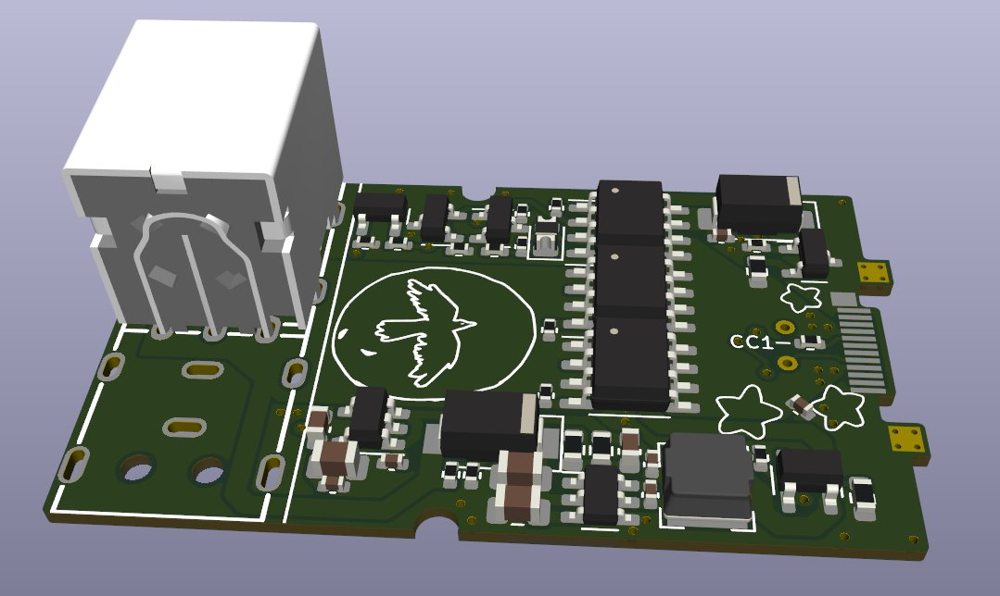
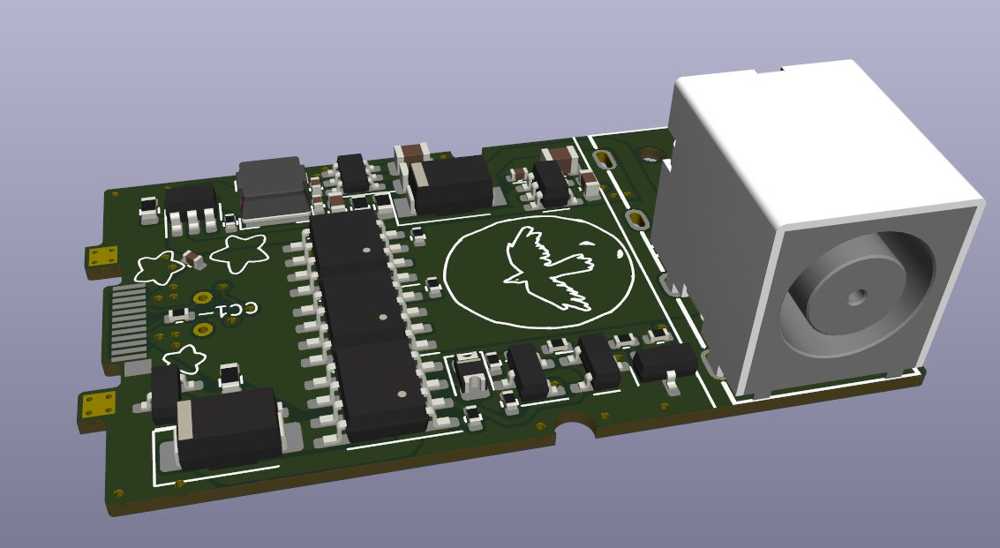
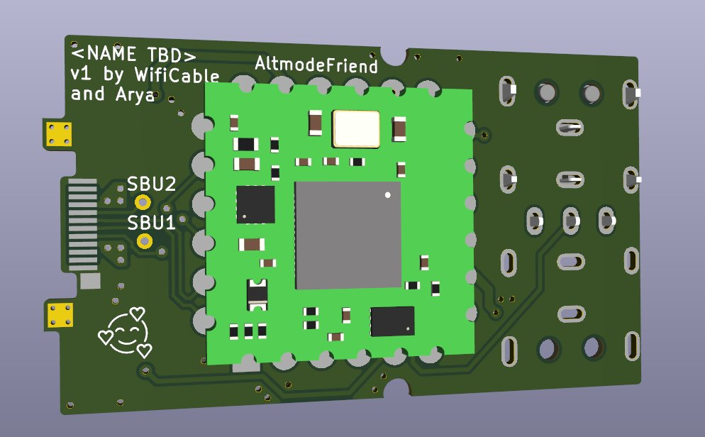

# Framework laptop DC-in module

This is a Framework laptop module designed to let you use Dell or HP laptop power supplies with a Framework laptop (or any other device that takes 20V USB-PD)

The schematic for this board was made by [Arya](https://github.com/CRImier), I tweaked it a bit and did the board layout.  
It requires an Altmode Friend, also made by Arya, to handle all the communication and control.

